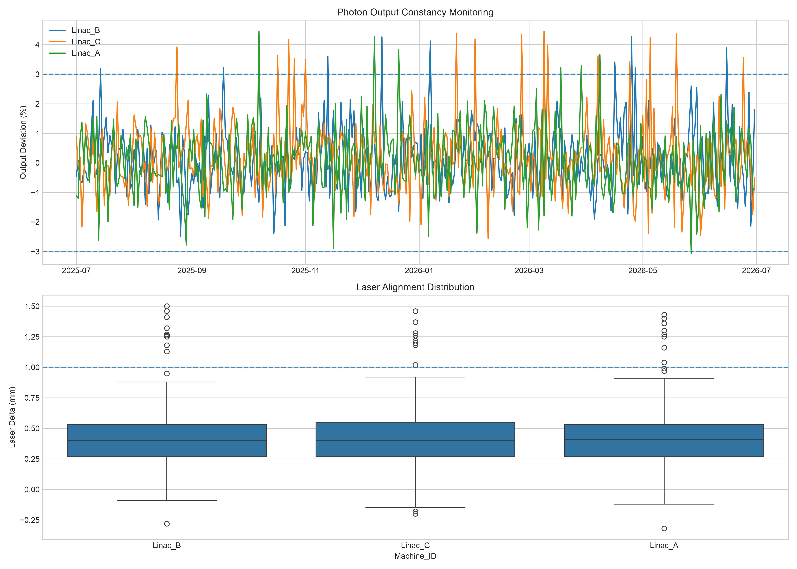

## 📊 Project Results & Deliverables

### Data Volume
- **12 months** of simulated Daily QA data
- **3 Linear Accelerators** monitored (Linac_A, Linac_B, Linac_C)
- **1,095 QA records** processed through the ETL pipeline
- Daily measurements captured for laser alignment, ODI accuracy, and photon output constancy

### Automated TG-142 Compliance Checks

The pipeline automatically evaluates each QA record against clinical tolerance thresholds based on AAPM TG-142 recommendations.

| QA Parameter | Tolerance |
|-------------|------------|
| Laser Alignment | ±1.0 mm |
| Optical Distance Indicator (ODI) | ±1.0 mm |
| Photon Output Constancy | ±3.0% |

Records exceeding any tolerance are automatically flagged as failed QA checks.

### Outputs Generated

- **SQLite Database:** `linac_qa.db`
- **Monthly Compliance Report:** `monthly_compliance_report.csv`
- **Trend Visualization Dashboard:** `linac_qa_trends.png`
- **Automated Pass/Fail Assessment** for every QA record
- **Machine-Level Compliance Metrics** for audit and quality monitoring

### Key Deliverables

- Automated Excel-to-SQL ETL pipeline
- Clinical QA compliance monitoring system
- Historical machine performance tracking
- Regulatory audit reporting capability
- Publication-quality data visualizations

### Sample Visualization

### Example Outcomes

- Successfully processed and analyzed **1,095 QA records**
- Generated monthly compliance statistics for all treatment machines
- Identified QA measurements approaching tolerance limits
- Automated TG-142 pass/fail assessments, reducing manual review effort
- Demonstrated a complete workflow spanning **Excel → Python → SQLite → Analytics → Visualization**
